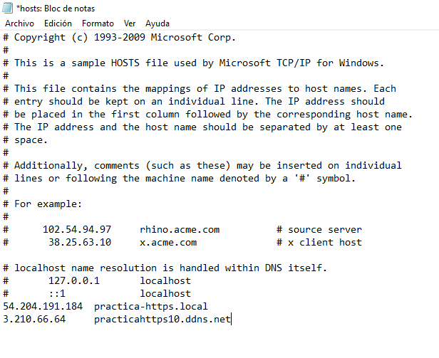
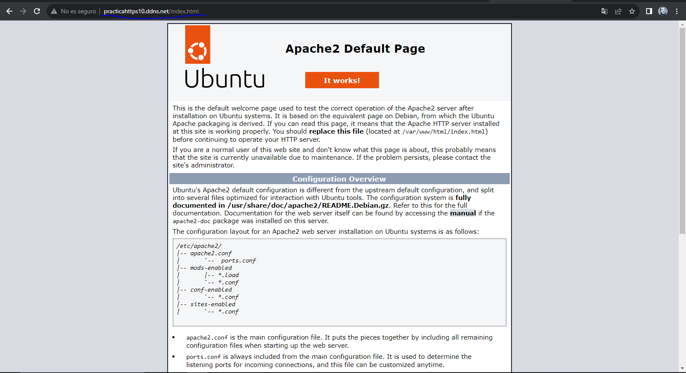

# Practica_5
### Pero,¿De que consta una pila LAMP?
Muy simple, con esto describimos un sistema de infraestructura de internet, lo que estamos buscando es desplegar una serie de aplicaciones en la web, desde un unico sistema operativo, esto quiere decir que, buscamos desplegar aplicaciones en la web de forma cómoda y rápida ejecutando un único script, el cual hay que configurar previamente.

### 1. Que representa cada letra de la palabra --> LAMP.

#### L --> Linux (Sistema operativo).
#### A --> Apache (Servidor web).
#### M --> MySQL/MariaDB (Sistema gestor de base de datos).
#### P --> PHP (Lenguaje de programación).

### Con esto, buscamos hacer un despligue de aplicaciones.

## 2. Contenido que debe incluir el script

Primero que nada vamos a empezar creando el script en nuestro ubuntu server:

Primero creamos una carpeta:

```
mkdir -p scripts
```

Segundo vamos a crear dentro nuestro archivo, el cual tendrá las instrucciones debe tener la extensión `.sh`.
```
nano script.sh
```
Ahora es necesario darle permisos, para que se pueda ejecutar.

```
chmod +x script.sh
```
Con esto le estamos añadiendo permisos de ejecución.

# 3. Comenzamos con lo importante...
### Creación del script.

Primero vamos a actualizar los repositorios, esto es muy importante ya que si no se actualizan los repositorios pueden llevar a problemas de instalaciones de software y demás.
```
sudo apt update
```
### Con esto actualizamos los repositorios, ``apt`` es el gestor de paquetes de ubuntu y debian.

## Tras eso vamos a comenzar con la instalación del servidor web.
### Insertamos el siguiente comando:
```
apt install apache2 -y
```
### ¿Que queremos actuar sobre el servicio? Muy simple.
```python 
systemctl start apache2.service
systemctl stop apache2.service
systemctl restart apache2.service
systemctl reload apache2.service
systemctl status apache2.service
```

*Importante --> Siempre que cambiemos algo en un fichero de configuración, se debe reiniciar el servicio, para que en caso, de que se añada algo con a2enmod o a2dismod, o a2ensite y a2dissite.*

### Una vez instalado, si ejecutamos ```ls /etc/apache2``` veremos los archivos de configuración y directorios de apache.
```
 1. Directorios
  1.1 conf-available --> donde se aplican los hosts virtuales.
  1.2 conf-enabled --> donde se encuentran enlaces simbolicos a los archivos de configuracion           
  de conf-available.
  1.3 mods-available --> para añadir funcionalidades al servidor.
  1.4 mods-enabled --> enlaces simbolicos a esas funcionalidades.
  1.5 sites-available --> archivos de configuración de hosts virtuales.
  1.6 sites-enabled --> enlaces simbolicos a sites-available.
 2. Ficheros
  2.1 apache2.conf --> Archivo de configuración principal.
  2.3 envvars --> Define las variables de entorno, que se usan en el archivo principal.
  2.3 magic --> Para determinar el tipo de contenido, por defecto es MIME.
  2.4 ports.conf --> archivo donde se encuentran los puertos de escucha de apache.
```

### En /etc/apache2 se almacenan los archivos y directorios de apache2.

## 4.Contenido del fichero /conf/000-default.conf.
Este archivo contiene la configuración del host virtual el cual debe contener las siguientes directivas para que funcione la aplicación web.

En la ruta del repositorio ``/conf/000-default.conf``, encontramos la configuración que se emplea para este despliegue.

```python
ServerSignature Off
ServerTokens Prod
<VirtualHost *:80>
    #ServerAdmin webmaster@localhost
    DocumentRoot /var/www/html
    DirectoryIndex index.php index.html 
    
    ErrorLog ${APACHE_LOG_DIR}/error.log
    CustomLog ${APACHE_LOG_DIR}/access.log combined
</VirtualHost>
```
*Sobre index.php, hablaremos mas adelante, el archivo de configuración está preparado de esta forma para que funcione.*

Aquí podemos comprobar lo que contiene el fichero de configuración del ``VirtualHost``, donde todas las conexiones pasaran por el puerto 80, el ``DocumentRoot``, donde mostrará el contenido será desde ``/var/www/html`` y podemos ver los archivos de error y acceso para comprobar errores y ver quien ha accedido, Tambien, tenemos la directiva ``Directory index`` la cual establece una prioridad en el orden que se establezca.

### También se hace uso de las siguientes directivas 
``ServerSignature OFF `` --> Esto es por si nos interesa incorporar la versión de apache, en páginas de error e indice de directorios, lo dejamos en OFF por seguridad. Se debe aplicar a todo el servidor.

``ServerTokens Prod `` --> Esta se puede aplicar a un único servidor virtual. Aquí se muestran información sobre las cabeceras, es decir, respuestas que se mandan al cliente, es conveniente tenerlo quitado.

## 5.Instalación de MySQL
### Vamos con la instalación de MySQL, siempre es conveniente actualizar repositorios, como se va a ejecutar el script completamente, en principio no hay problema pero viene bien saberlo.

```
sudo apt install mysql-server -y
```

Aquí solo voy a incluir como instalarlo, mas adelante aparecerán espectos importantes sobre mysql server.

### Eso si algo importante a destacar, son sus archivo de configuración, en caso de querer modificar ciertas cuestiones, que se veran mas adelante.

## 6.Instalación de php
```
sudo apt install php libapache2-mod-php php-mysql -y
```

### Como podemos ver aquí, instalamos las librerias de apache2 para php y mysql en php.

## 7.Conexión a php a traves del navegador.
En nuestro repositorio podemos encontrar un directorio llamado php que contiene un archivo llamado index.php
que viene modificado con la siguiente script en su interior.

```php
<?php

phpinfo();

?>
```
### Esto va a mostrar información de php, dando a entender que se instaló correctamente, pero primero que nada para poder, mostrarlo hay que tener en cuenta que estamos trajando con una pila lamp, desde apache tenemos que hacer que ese archivo se muestre el primer según el orden de prioridad.

*Si os acordais del fichero, llamado index.php anterior, puesto el primero en la prioridad, lo que vamos a hacer es un copiado, del archivo de configuración para establecer sitios en la web.*

### En esta instrucción del script copiamos, el archivo que contiene nuestro host virtual en ``sites-available``.

```
sudo cp ../conf/000-default.conf /etc/apache2/sites-available
```

### En este caso, no haría falta emplear el comando ```a2ensite``` , ya que se habilita por defecto debido a que apache2 toma por defecto la configuración de ese archivo para desplegar las opciones que hemos hecho en la web.

*RECORDATORIO.-Las instrucciones de apache2: a2ensite y a2dissite funciona unicamente con sitios que hayamos creado a mano, ya sabes esto crea un enlace simbólico a el archivo sitioinventado.conf ubicado en el directorio, sites-available.*

#### *Para mas información, veo conveniente el acceder aquí:
[1]:https://josejuansanchez.org/iaw/practica-01-01-teoria/index.html
[1] <-- Acceso a mas información sobre Apache2.

## 8.Reinicio del servicio
### Reiniciamos el servicio para que la configuración que hemos añadido previamente, se valide.
```
sudo systemctl restart apache2
```

### Ojo, esto no quiere decir que vaya a funcionar, queda un paso importante, como podemos ver en los datos del fichero 000-default.conf:

```
ServerSignature Off
ServerTokens Prod
<VirtualHost *:80>
    #ServerAdmin webmaster@localhost
    DocumentRoot /var/www/html
    DirectoryIndex index.php index.html
    
    ErrorLog ${APACHE_LOG_DIR}/error.log
    CustomLog ${APACHE_LOG_DIR}/access.log combined
</VirtualHost>
```
### Nosotros hemos añadido la configuración a sites-available, pero no quiere decir que funcione, en DocumentRoot, podemos ver la ruta en la que cargan las paginas web del directorio sites-available en la ruta ``/var/www/html`` --> no hemos colocado el archivo de prueba, ``index.php``

Para ello empleamos:

```
sudo cp ../php/index.php /var/www/html
```

#### En caso de duda los dos puntos de cp .. simboliza al directorio padre, es decir por encima de donde estamos ahora mismo.

### Como último paso en el script de instalación, nos toca modificar el propietario y el grupo del directo /var/www/html esto es necesario hacerlo, si hacemos un ``more /etc/passwd`` veremos que el usuario para apache es ```www-data```.

Es necesario que este usuario sea propietario y grupo de dicho archivo para que puede mostrar el contenido asociado al directorio /``var/www/html``.
### Y con esto se emplearía el siguiente comando.
```
sudo chown -R www-data:www-data /var/www/html
```
### Con esto terminaría las instrucciones del archivo ``script/script.sh``, ya hemos visto que usando únicamente un script, hemos desplegado una cantidad ingente de aplicaciones, de forma automática.

# 9.Conexiones
### Ahora podriamos conectarnos a traves de nuestro navegador a nuestra pagina index.php

En el navegador --> ``http://nuestraipservidor/index.php``, y debería salirnos.

# Autoridad certificadora con certbot 

### Con esto, lo que vamos a hacer será actuar con certbot el cual es una herramienta de codigo libre, empleada para securizar sitios web mediante lets encrypt, es decir para habilitar el https. Lets encrypt es la autoridad de certificación, lo que certifica que nuestra página web es segura, incorporando ssl/tls.

### Comandos principales.

# Muestra todos los comandos que se han ejeutado.
```
set -ex
```
### Y además detiene el script si hay un error.

# Actualización de repositorios
```
 apt update
```
### En este apartado se actualiza el sistema.

# Actualización de paquetes
# sudo apt upgrade 

# Importamos el archivo de variables .env
```
source .env
```
## Primero que nada tenemos que crear un dominio.
### Para que nos aporté ssl a nuestro sitio web una autoridad certificadora, por eso he comentado anteriormente lo de lets encrypt, y diréis ¿como se ha hecho?

### Primero lo que he hecho es crear un dominio asociado a una ip publica, para ello he usado no ip, el cual aporta este tipo de cosas de forma gratuita, si quereis usar un correo chorra, generado aleatoriamente. 

--> *Recuerda: Hay que asignar la ip publica a dicho dominio, y tiene que ser la ip de la máquina con la que se este trabajando.*

[Pagina de NOIP]:https://www.noip.com/es-MX/remote-access?gclid=CjwKCAiA3aeqBhBzEiwAxFiOBmMq35PBpDm5zJtuuOJl3g964IfHMTdRTRWMJEd8tlg023xuXUH9ARoCe0kQAvD_BwE&utm_campaign=free-dynamic-dns&utm_medium=cpc&utm_source=google

[Pagina de NOIP] <-- Accede aquí.

##

### Incorporamos al script las variables desde el archivo .env, el cual contiene:

```
CERTIFICATE_EMAIL=demo@demo.es
CERTIFICATE_DOMAIN=practicahttps10.ddns.net
```
### Mas adelante se explicará su uso.

# Instalación de snap y actualizacion del mismo.
```
snap install core
snap refresh core
```
### Pero, ¿Qué es snap y para que lo necesitamos? Es un gestor de paquetes, lo necesitamos para la instalación de certbot, es muy seguro y dispone de una serie de actualizaciones solidas, siendo este gestor de paquete robusto, reutilizable, modular y bastante optimizado.

# Borramos certbot para instalarlo despues, en caso de que se encuentre, lo borramos de apt para instalarlo con snap.
```
apt remove certbot
```
### Primero necesitamos borrar certbot para que, en caso de que se ejecute un segundo script no haya algún problema.

# Instalamos la aplicacion certbot
```
snap install --classic certbot
```
### Donde --classic hace que dicha aplicación se instale, con una serie de permisos para que forme parte de un entorno seguro y aislado teniendo acceso a recursos del sistema que a lo mejor no podría tener.

# Creamos un alias para la aplicacion certbot
```
ln -sf /snap/bin/certbot /usr/bin/certbot
```
### Creamos un enlace simbólico donde:
```
ln --> Para crear un enlace en el sistema.
-s --> El tipo de enlace que crea es simbólico.
-f --> Para que lo cree por la fuerza.
```
Tras eso, hemos creado un enlace simbolico en ``/usr/bin`` para que se ejecute una vez lo llamamos, es decir para que se ejecute.

# Obtener el certificado.
### Aquí es donde las variables del archivo .env toman lugar en este despligue de aplicaciones.
```
certbot --apache -m $CERTIFICATE_EMAIL --agree-tos --no-eff-email -d $CERTIFICATE_DOMAIN --non-interactive
```
Nosotros si solo insertasemos ``certbot --apache``, lo ejecutaría pero, interrumpería la automatización del script, ya que buscamos que se realice automáticamente, esto se debe a que aparecen asistentes donde hay que insertar una serie de datos.

```
--apache: Esto significa que da el certificado para apache.
-m: Establecemos la direccion de correo la cual la contiene la variable $CERTIFICATE_EMAIL del archivo .env, se puede cambiar por otra.
--agree-tos: Con esto aceptamos terminos de uso.
--no-eff-email: Con esto no compartimos nuestro email con la EFF.
-d: El dominio que contiene la variable: $CERTIFICATE_DOMAIN.
--non-interactive: Para que declarar que se hace de forma no interactiva. 
```

### Ejecutamos:
```
systemctl list-timers
```
Para comprobar que hay un temporizador en el sistema el cual realiza la renovación de los certificados de forma automática.

# *Extra* Acceso al sitio mediante el nombre de dominio.

### Para ello en windows 10 accedemos al directorio: C:\windows\system32\drivers\etc\hosts

### Y añadimos la ip pública a la que va a redirigir y el nombre de dominio en el archivo hosts quedariá algo así.



*¡No te olvides de guardar el fichero!*

## Comprobación de que el dominio funciona.



### Y aquí lo tenemos el dominio funciona.
